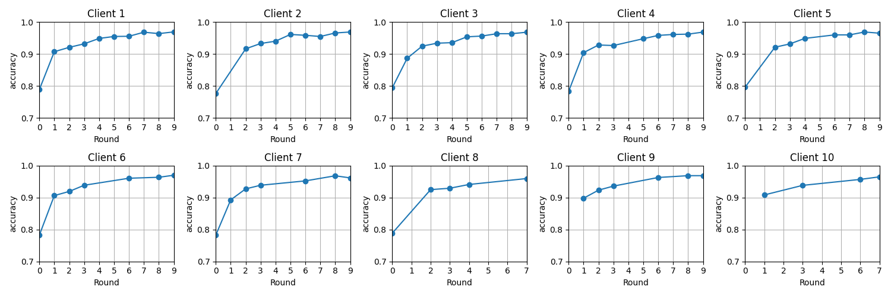
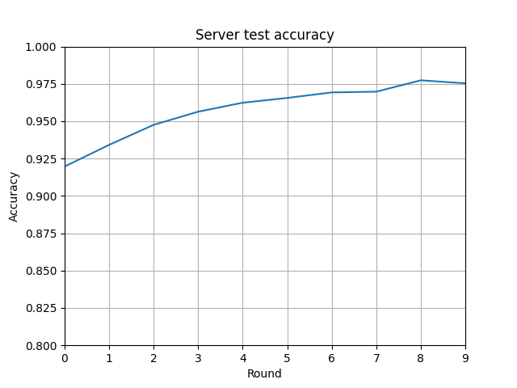
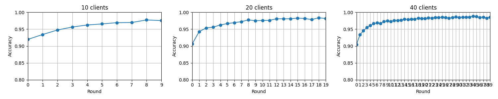

# Aprendizado Federado
Esta é uma implementação de Aprendizado Federado usando o algoritmo *Federated Average*. Explicação em vídeo pode ser encontrado neste [link](https://youtu.be/umYhUZNY5Rc).

Implementado por: Beatriz Maia, Iago Cerqueira & Sophie Dilhon

## Executando a aplicação
### Configuração do ambiente
A aplicação foi feita usando Python 3.10 e há algumas bibliotecas que você pode precisar instalar.
Recomenda-se a utilização de um ambiente virtual, para isso você pode executar os seguintes comandos:

```sh
python -m venv {environment}
```

onde {environment} pode ser qualquer nome de sua escolha. Depois de criá-lo, ele deve ser ativado. No Linux e Mac, use o seguinte comando:

```sh
source /{environment}/bin/activate
```

e no Windows:

```sh
.\{environment}\Scripts\activate
```

Finalmente, instale as dependências com

```sh
pip install -r requirements.txt
```

### Execution
Para executar o sistema, primeiro execute um dos seguintes scripts. Eles são responsáveis ​​por criar os arquivos usados ​​pelos clientes e servidor para a comunicação via grpc.

```sh
# Mac or Linux
./config.sh

# Windows
.\config.bat
```


Para executar o servidor e os clientes, execute os seguintes comandos em diferentes terminais. 
```sh
python server.py --min_clients_per_round {n} --max_clients_total {m} --max_rounds {r} --accuracy_threshold {a} --timeout {t} --save_model --save_test
python client.py --ipv4 {i} --batch_size {b} --save_train --save_test
```

Significado das *flags* do servidor:
--min_clients_per_round: Número mínimo de clientes por rodada.
--max_clients_total: Número máximo de clientes por rodada.
--max_rounds: Número máximo de rodadas.
--accuracy_threshold: Limite mínimo de precisão.
--timeout: Tempo limite em segundos para o servidor entre as sessões de treinamento.
--save_model: Salve o modelo após o treinamento. Isso significa que o servidor usará esse modelo para os próximos treinamentos.
--save_test: salva os resultados do teste em um arquivo csv.

Significado das *flags* do cliente:
--ipv4: endereço IPv4 do cliente.
--save_train: Salve os resultados do treinamento em um arquivo csv.
--save_test: Salve os resultados do teste no arquivo csv.
--batch_size: Tamanho do batch para treinamento.

Vários clientes podem ser criados. Os *flags* não são obrigatórios, o servidor usará valores padrão se nenhum argumento for passado.

## Implementação

### Comunicação
Para estabelecer a comunicação entre servidor e clientes e vice-versa, foi utilizada a lib grpc, e foram criados dois arquivos proto. O primeiro, [server.proto](proto/server.proto), é responsável por implementar os métodos disponíveis no servidor, e o outro, [client.proto](proto/client.proto), é responsável por implementar os métodos disponíveis nos clientes métodos. Para esta implementação, o lado responsável por calcular a média federada centralizada é denominado de servidor, e o lado responsável por treinar os modelos "localmente" são os clientes.

#### Métodos

O servidor possui apenas um método, que é responsável por receber e salvar os dados do cliente, e verificar se o treinamento pode começar.
```sh
add_trainer(trainer_request) returns (success);
```

Quanto ao cliente, foram criados três métodos.
- O primeiro é responsável por treinar o modelo com os dados locais, e retorna ao servidor os pesos do modelo.
    ```sh
    train_model(models_weights_input) returns (models_weights_output);
    ```
- O segundo, recebe os pesos agregados e testa o modelo com os dados locais.
    ```sh
    test_model(models_weights) returns (metrics_results);
    ```
- O último termina o servidor do cliente
    ```sh
    finish_training(finish_message) returns (finish_message);
    ```

### Server

O servidor roda em `localhost:8080` e é responsável por iniciar e finalizar o treinamento. O código que o representa pode ser encontrado em [server.py](server.py). A lógica geral por trás disso pode ser descrita pelas seguintes etapas:

1. O servidor é inicializado e conectado a localhost:8080. Ele espera que os clientes se conectem.
2. Quando `max_clients_total` estiver conectado ao servidor, ele iniciará o treinamento, enviando para cada um deles os pesos do modelo, rodada atual e número de clientes treinados, bem como o ID da sessão de treinamento. Para fazer isso, o servidor deve se conectar aos servidores do cliente usando seu ipv4 e porta (endereço).
3. Após o treinamento, cada cliente envia de volta ao servidor os pesos de seus modelos.
4. O servidor agrega os pesos calculando a média federada, onde os modelos que treinaram com mais amostras recebem mais importância. Isso pode ser resumido por:
    ```py
    sum(weights * local_sample_size) / sum(local_sample_size)
    ```
5. Os novos pesos são enviados para todos os clientes (mesmo não treinadores), que então testam o modelo e retornam a precisão treinada em seus dados locais.
6. Por fim, a média das precisões é comparada com o *threshold*, se for menor e a rodada atual < `max_rounds` então uma nova rodada é iniciada. Caso contrário, o treinamento termina, os clientes fecham seus servidores e o servidor volta para a etapa 2.

Para que o servidor pudesse tanto receber a requisição quanto aguardar o treinamento e/ou o iniciar, foi necessário o uso de thread. Quando a classe `TrainerAgregator` é inicializada no servidor, o seguinte código é executado:

```py
threading.Thread(target=self.__train).start()
```

Isso faz com que uma segunda thread esteja rodando, executando o método __train. Este método é o responsável por ouvir e desencadear uma sessão de treinamento. Para ter uma diferença de tempo entre cada sessão de treinamento, adicionamos um tempo limite após a conclusão de uma sessão. Isso significa que se uma sessão for finalizada e novos clientes estiverem disponíveis, o treinamento só começaria após o término do tempo limite.

Uma decisão importante tomada durante a implementação foi permitir que novos clientes entrassem quando uma sessão começasse. Isso significa que, embora esse cliente não participe da rodada de treinamento atual, ele pode ser escolhido para as próximas rodadas.

Os clientes são executados em uma porta de geração aleatória em `localhost`, no entanto, isso pode ser alterado se o argumento ipv4 for configurado de outra forma. O código que representa cada cliente pode ser encontrado em [client.py](client.py). Eles acabam tendo um tipo de comportamento tanto de cliente quanto de servidor. Como cliente, eles adicionam treinadores ao servidor. Como servidor, eles treinam os modelos e retornam os pesos.

Para simular dados no lado do cliente, usamos o tensorflow MNIST e reduzimos os conjuntos de dados de treinamento e teste. Durante a parte do trem do código, isso pode ser observado por
```py
percentage = int(1 / (request.number_of_trainers + 10) * 100)
min_lim = min(5, percentage)
random_number = randint(min_lim, percentage) / 100

sample_size_train = int(random_number * len(self.x_train))
```
Esta seção de código tenta obter uma parte dos dados do treinamento, dependendo de quantos treinadores estão atualmente naquela rodada. Para que os clientes tenham um conjunto de dados ainda menor, facilitando a visualização das melhorias dos modelos entre as rodadas durante a análise, o denominador é aumentado em 10. Para ter também uma variedade de pesos, onde cada cliente pode contribuir de forma diferente para o cálculo da média federada, adicionamos uma etapa extra de aleatoriedade. Esta etapa pode ser traduzida em: escolha um tamanho de amostra que esteja entre 5% e a porcentagem calcule de antemão. Adicionamos um min_lim apenas no caso de se a porcentagem calculada anteriormente ser menor que 5%.

Para teste, consideramos o mesmo tamanho de dados entre todos os treinadores.
```py
sample_size_test = int((1/request.number_of_trainers)*len(self.x_test))
```

## Analysis

Esta análise é feita considerando que 10 max trainers foram usados. Para cada rodada, a quantidade mínima de treinadores era de 5, mas poderiam ser usados ​​mais. Um total de 10 rodadas foram feitas.

Na imagem abaixo podemos acompanhar o treino dos 10 diferentes clientes. Os modelos começam com alguns exemplos de dados, o que resulta em uma acurácia de cerca de 80%. Nem todos os clientes treinaram na primeira rodada (ou em todas as rodadas), apenas clientes com um marcador 'o' na rodada 0.


Depois que a média federada é calculada e enviada para os novos clientes na rodada 1, a acurácia dispara. Isso mostra que o uso do algoritmo ajudou muito, com um aumento de 10%. Isso indica que, embora os clientes entre si tenham dados limitados, ao calcular a média entre eles, foi possível criar um modelo mais preciso.

À medida que as rodadas aumentam, a acurácia também, mas em uma rampa mais lenta.


Analisando a acurácia média do teste pelo tamanho do servidor, também podemos ver esse aumento na acurácia. Enquanto os modelos de treino iniciam em percentual bem menor, o teste considera o modelo calculado pela média federada, e mostra o que foi observado na rodada 1 de treino. Os resultados do teste da rodada 0 já estão acima de 90%. À medida que as rodadas aumentam, também aumenta a acurácia.


Rodando para diferente número de rodadas, é possível observar como a acurácia aumenta, porém não é um aumento tão grande. Os dados MNIST são muito simples, portanto isso é esperado.


Esses resultados podem ser comparados aos resultados do [Lab 2](https://github.com/AHalic/SisDist_Labs/tree/main/Lab_2). Enquanto a forma tradicional de treinamento, com todos os dados do MNIST, resultou em quase 100% de precisão, o resultado da média federada também foi extremamente alto, mas não chegava em 99%. Nossa implementação teve um resultado semelhante à implementação do flwr.

